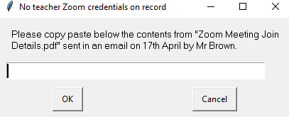

# Greenfield Zoomer


## Installing on your local system

* Clone from github

* Create a virtual environment (I'm using Python 3.6)

* Install requirements

```pip install -r requirements.txt```

* Use PyInstaller to create a distribution using the zoomer.spec file for instructions

```pyinstaller zoomer.spec```

## How to use
copy the dist folder to your computer. I created a shortcut to the exe file within that folder and put it on my desktop. THe first time you run the exe, you'll be asked the below:



## Useful info
* using [PyInstaller](https://www.pyinstaller.org/) which hopefully means app will work on PC, MAC or Linux, with an easy installation.

## Best to take care of the following
* Best we don't add teachers' zoom creds to our git repo ;)

## Things to do
* GUI. Perhaps a grid of teachers' faces
* Figure out how to make a file for circulation
* Cross platform support?